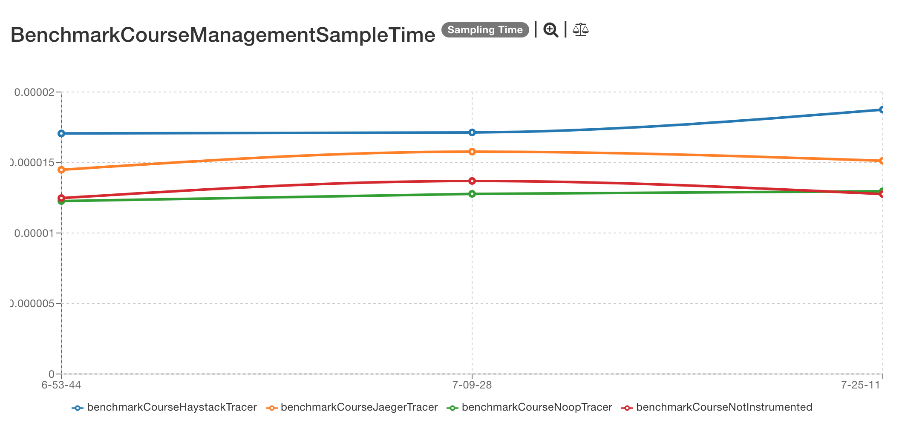
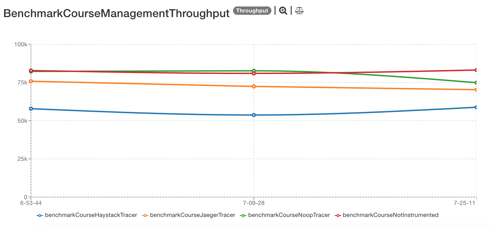

# Latest results

The latest results are located [here](http://jmh.morethan.io/?sources=https://raw.githubusercontent.com/gsoria/opentracing-java-benchmark/master/opentracing-benchmark-java-jdbc/results/jmh-2019-04-07-16-53-44.json,https://raw.githubusercontent.com/gsoria/opentracing-java-benchmark/master/opentracing-benchmark-java-jdbc/results/jmh-2019-04-07-17-09-28.json,https://raw.githubusercontent.com/gsoria/opentracing-java-benchmark/master/opentracing-benchmark-java-jdbc/results/jmh-2019-04-07-17-25-11.json&topBar=Opentracing%20java%20jdbc).
These graphics are constructed based on raw results located in the ``results`` folder.

## Description

These tests use a sample [spring boot application](https://github.com/tachuela700/course-management) containing a basic course management process.

The application is initialized for each test iteration in the [`BenchmarkCourseManagementBase`](src/main/java/io/opentracing/contrib/benchmarks/BenchmarkCourseManagementBase.java), 
and using profiles, the right tracer is injected, see [`TracerConfiguration`](src/main/java/io/opentracing/contrib/benchmarks/config/TracerConfiguration.java).

The different tests measure the process of getting the list of all courses in a not instrumentation scenario and instrumented with different tracers. 
The tests are performing the operation calling to the Spring services directly.

In the application properties, the url and driver class name are modified to enable the tracing:

```properties
### Define H2 Datasource config
spring.datasource.platform=h2
spring.datasource.url=jdbc:tracing:h2:mem:app_db;DB_CLOSE_ON_EXIT=FALSE
spring.datasource.username=sa
spring.datasource.driver-class-name=io.opentracing.contrib.jdbc.TracingDriver
spring.data.jpa.repositories.enabled=false
```

## Dependencies

This project uses this [Opentracing dependency](https://github.com/opentracing-contrib/java-jdbc):

```xml

    <opentracing.version>0.31.0</opentracing.version>
    <jaeger.version>0.31.0</jaeger.version>
    <haystack.version>0.2.5</haystack.version>
	<opentracing.jdbc.version>0.0.12</opentracing.jdbc.version>

    <dependency>
        <groupId>io.opentracing.contrib</groupId>
        <artifactId>opentracing-jdbc</artifactId>
        <version>${opentracing.jdbc.version}</version>
    </dependency>
```

And for the different tracer implementations these dependencies:

```xml
    <dependency>
        <groupId>io.opentracing</groupId>
        <artifactId>opentracing-noop</artifactId>
        <version>${opentracing.version}</version>
    </dependency>
    <dependency>
        <groupId>io.opentracing</groupId>
        <artifactId>opentracing-mock</artifactId>
        <version>${opentracing.version}</version>
    </dependency>
    <dependency>
        <groupId>io.jaegertracing</groupId>
        <artifactId>jaeger-client</artifactId>
        <version>${jaeger.version}</version>
    </dependency>
    <dependency>
        <groupId>com.expedia.www</groupId>
        <artifactId>haystack-client-core</artifactId>
        <version>${haystack.version}</version>
    </dependency>
```

## SampleTime metrics

- X axis: represents each execution result.
- Y axis: represents how long time it takes for the benchmark method to execute.




## Throughput metrics

- X axis: represents each execution result.
- Y axis: represents of number of operations per second  (the number of times per second the benchmark method could be executed).




## Previous results
The previous results are located [here](results-md/previous.md).

## Environment
The tests were executed in a personal notebook with these characteristics:

- Model Name:	MacBook Pro
- Processor Name:	Intel Core i5
- Processor Speed:	2.6 GHz
- Number of Processors:	1
- Total Number of Cores:	2
- L2 Cache (per Core):	256 KB
- L3 Cache:	3 MB
- Memory:	8 GB
